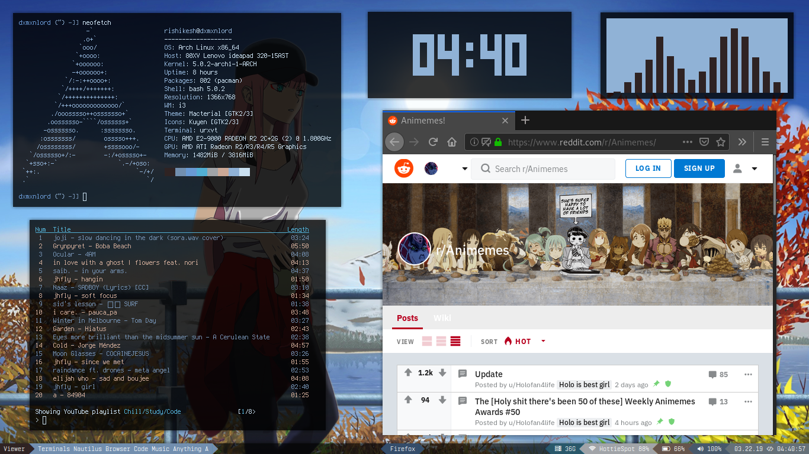
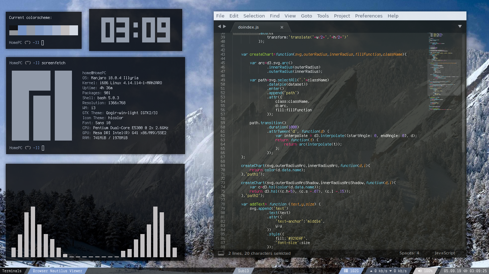
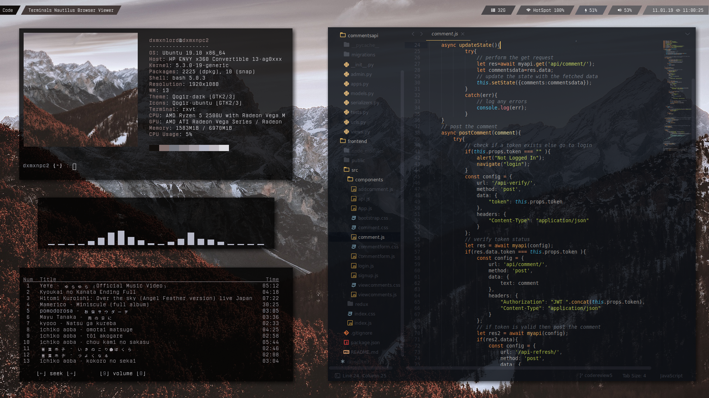
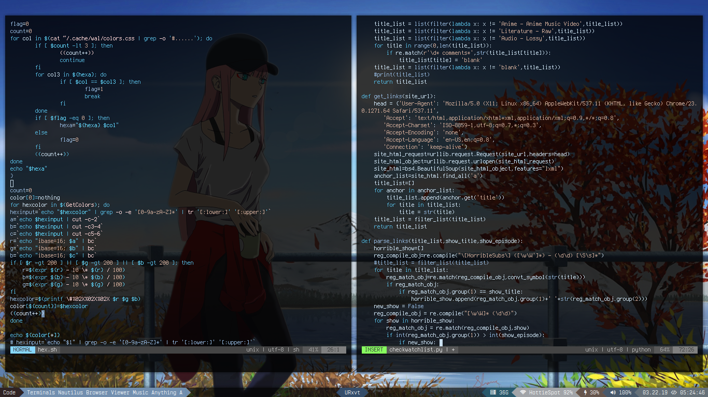
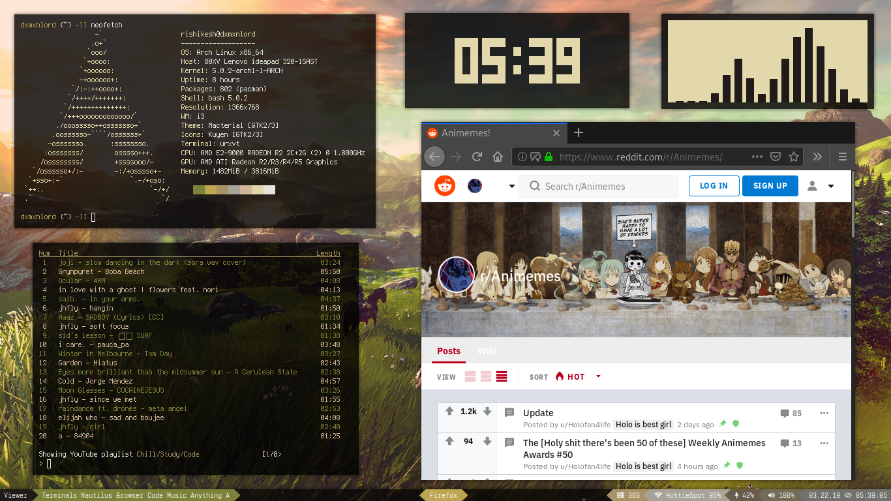

# Arch Linux Resources

## Contents
This repository contains 2 things :
- #### My Arch Linux configuration files
- #### A tutorial on installing and configuring Arch Linux with i3-gaps as the desktop environment.

## Important links
- [The Arch Wiki](https://wiki.archlinux.org/)
- [i3wm Docs](https://i3wm.org/)
- [Arch Packages](https://www.archlinux.org/packages/)
- [The AUR](https://aur.archlinux.org/)
- [Arch Forums](https://bbs.archlinux.org/)

## Preview
### Home Screen

### On 32-bit Manjaro [(gilded)](https://www.reddit.com/r/unixporn/comments/bmubrq/i3gaps_had_a_32bit_pc_at_home_with_xpyuck_so_i/)

### Ubuntu

### While Programming

### Alternate Theme

